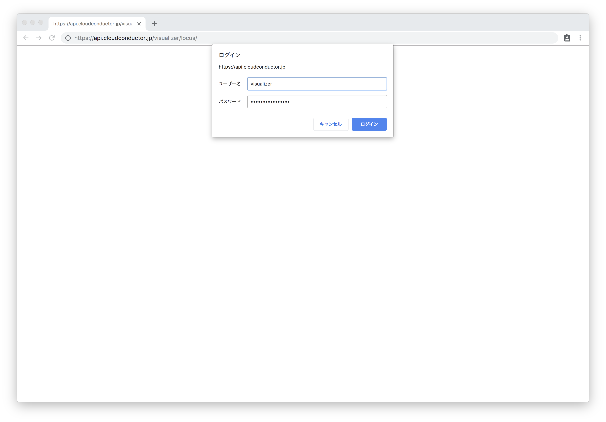

# Turtlebot3 試験環境 インストールマニュアル #7


## 構築環境(2019年7月18日現在)


# データの視覚化


## 環境変数の設定
1. 環境変数の設定

    ```
    $ export CORE_ROOT=$HOME/core
    $ export PJ_ROOT=$HOME/example-turtlebot3
    $ cd $PJ_ROOT;pwd
    ```

    - 実行結果（例）

        ```
        /home/fiware/example-turtlebot3
        ```

1. 環境ファイルの実行

    ```
    $ source $CORE_ROOT/docs/environments/azure_aks/env
    $ source $PJ_ROOT/docs/environments/azure_aks/env
    ```

## コマンドのエイリアスを設定
1. エイリアスの設定

    ```
    $ if [ "$(uname)" == 'Darwin' ]; then
      alias openbrowser='open'
    elif [ "$(expr substr $(uname -s) 1 5)" == 'Linux' ]; then
      alias openbrowser='xdg-open'
    else
      echo "Your platform ($(uname -a)) is not supported."
      exit 1
    fi
    ```

## turtlebot3の軌跡を表示

1. ユーザ名とパスワードの確認

    ```
    $ cat ${CORE_ROOT}/secrets/auth-tokens.json | jq '.[]|select(.host == "web\\..+$")|.settings.basic_auths[0].username' -r
    ```

    ```
    $ cat ${CORE_ROOT}/secrets/auth-tokens.json | jq '.[]|select(.host == "web\\..+$")|.settings.basic_auths[0].password' -r
    ```

1. turtlebot3の軌跡を表示

    ```
    $ openbrowser https://web.${DOMAIN}/visualizer/locus/
    ```

    1. ユーザ名とパスワードを入力しログイン

        

    1. turtlebot3を動かした日付と時間を「start datetime」と「end datetime」に入力し「show」をクリック

        

    1. turtlebot3が移動した軌跡が表示されることを確認

        
