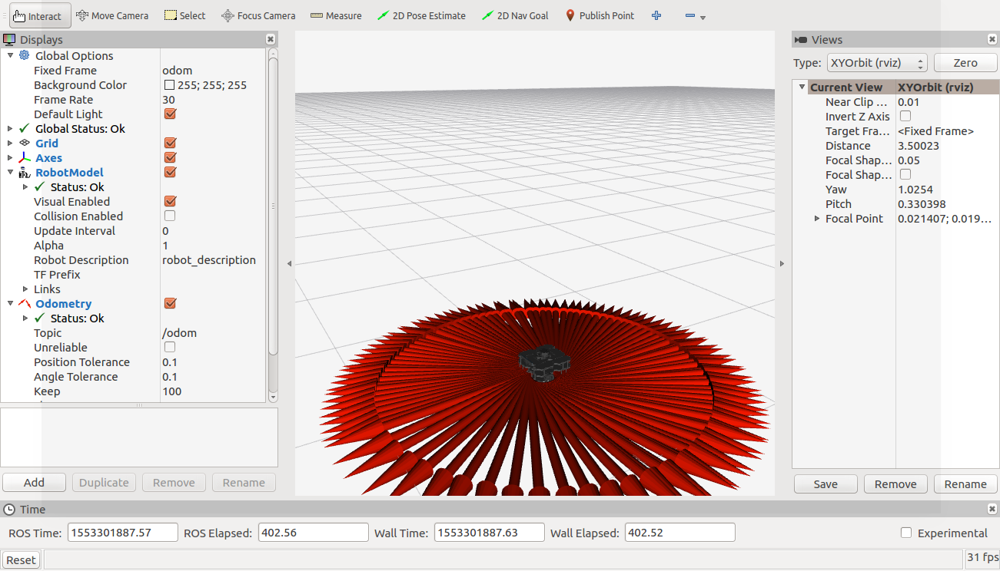

# Turtlebot3 試験環境 インストールマニュアル #6


## 構築環境(2019年7月18日現在)

# gemepadの準備

gamepadを利用する場合はCの手順、Webコントローラーを利用する場合はDの手順を実施します

## C.gamepadでturtlebot3を操作

### Raspberry Piにgamepadを接続

1. sshでRaspberry Piに接続

1. gamepadコントローラのベースファイルの取得

    ```
    rasberrypi$ git clone https://github.com/RoboticBase/fiware-gamepad-controller.git
    ```

### MQTTブローカーの設定

1. mqttファイルの編集

    ``` 
    raspberrypi$ cp conf/pxkwcr-minikube.yaml.template conf/pxkwcr-minikube.yaml
    raspberrypi$ vi conf/pxkwcr-minikube.yaml
    ```

    ※host,username,passwordの項目を編集してください

    ```
    name: "FUJIWORK PXKWCR Controller"
    controller:
      buttons:
        - key: 0
          value: "triangle"
        - key: 1
          value: "circle"
        - key: 2
      value: "cross"
        - key: 3
          value: "square"
      hats:
        - x: 0
          y: 1
          value: "up"
        - x: 0
          y: -1
          value: "down"
        - x: 1
          y: 0
          value: "right"
        - x: -1
          y: 0
          value: "left"
    mqtt:
      host: "${MQTT_HOST}"
      port: 1883
      username: "raspberrypi"
      password: "${RASPI_RASSWORD}"
      topics:
        - key: "controller"
          value: "/demo1/gamepad/attrs"
    ```

1. bridge node用のPythonライブラリのインストール

    ```
    raspoberypi$ pip install -r requirements/common.txt
    ```

### gamepadの起動

1. gemepadの起動

    ```
    raspberrypi$ ./main.py pxkwcr-minikube
    ```

    - 実行結果（例）

        ```
        2018/07/19 14:20:12 [   INFO] src.controller - connected mqtt broker[192.168.99.1:1883], response_code=0
        ```

### turtlebot3の動作確認

1. gamepadの「〇」をクリック

1. turtlebot3が移動したことを確認


## D.WEBコントローラーでturtlebot3を操作

### 環境変数の設定
1. 環境変数の設定

    ```
    $ export CORE_ROOT=$HOME/core
    $ export PJ_ROOT=$HOME/example-turtlebot3
    $ cd $PJ_ROOT;pwd
    ```

    - 実行結果（例）

        ```
        /home/fiware/example-turtlebot3
        ```

1. 環境ファイルの実行

    ```
    $ source $CORE_ROOT/docs/environments/minikube/env
    $ source $PJ_ROOT/docs/environments/minikube/env
    ```

## コマンドのエイリアスを設定
1. エイリアスの設定

    ```
    $ if [ "$(uname)" == 'Darwin' ]; then
      alias openbrowser='open'
      alias externalHostIp='ifconfig ${IFNAME} | awk '"'"'/inet / {print $2}'"'"
    elif [ "$(expr substr $(uname -s) 1 5)" == 'Linux' ]; then
      alias openbrowser='xdg-open'
      alias externalHostIp='ifconfig ${IFNAME} | awk '"'"'/inet / {print $2}'"'"' | cut -d: -f2'
    else
      echo "Your platform ($(uname -a)) is not supported."
      exit 1
    fi
    ```

## minikubeが動作しているPCのLAN向けIP addressの取得
1. minikubeが動作しているPCがLANに接続しているInterfaceの名前を確認

    ```
    $ export LANG=C
    $ ifconfig 
    ```

1. 確認したInterface名を環境変数 `IFNAME` に設定

    ※ Interface名が `en0` だった場合

    ```
    $ export IFNAME="en0"
    ```

1. minikubeのLAN向けipを設定

    ```
    $ export EXTERNAL_HOST_IPADDR=$(externalHostIp); echo ${EXTERNAL_HOST_IPADDR}
    ```

    - 実行結果（例）

        ```
        172.16.10.25
        ```

### Webコントローラの起動

1. ユーザ名とパスワードの確認

    ```
    $ cat ${CORE_ROOT}/secrets/auth-tokens.json | jq '.[0].settings.basic_auths | map(select(.allowed_paths[] | contains ("/controller/web"))) | .[0].username' -r
    ```

    ```
    $ cat ${CORE_ROOT}/secrets/auth-tokens.json | jq '.[0].settings.basic_auths | map(select(.allowed_paths[] | contains ("/controller/web"))) | .[0].password' -r
    ```

1. web controllerの表示

    ```
    $ openbrowser http://${HOST_IPADDR}:8080/controller/web/
    ```

### turtlebot3の動作確認

1. turtlebot3の動作確認【turtlebot3-pc】

    1. 「ユーザ名」と「パスワード」を入力し、「OK」をクリック

	      

    1. web controllerの「〇」をクリック

        

    1. turtlebot3が移動したことを確認

        


### robotのプログラムを変更
1. tagを指定

    ```
    $ export OPERATOR_GIT_REV="0.3.0"
    ```

1. fiware-ros-turtlebot3-operator-deployment-minikube-wideを削除

    ```
    $ TOKEN=$(cat ${CORE_ROOT}/secrets/auth-tokens.json | jq '.[0].settings.bearer_tokens[0].token' -r)
    $ docker run -it --rm -v ${PJ_ROOT}:${PJ_ROOT} -w ${PJ_ROOT} example_turtlebot3:0.0.1 \
      ${PJ_ROOT}/tools/deploy_yaml.py --delete ${PJ_ROOT}/ros/fiware-ros-turtlebot3-operator/yaml/fiware-ros-turtlebot3-operator-deployment-minikube-wide.yaml http://${HOST_IPADDR}:8080 ${TOKEN} ${FIWARE_SERVICE} ${DEPLOYER_SERVICEPATH} ${DEPLOYER_TYPE} ${DEPLOYER_ID}
    ```

    - 実行結果（例）

        ```
        delete /home/ros/example-turtlebot3/ros/fiware-ros-turtlebot3-operator/yaml/fiware-ros-turtlebot3-operator-deployment-minikube-wide.yaml to http://172.16.10.25:8080
        status_code=204, body=
        ```

1. turtlebot3-operatorのpodを確認【turtlebot3-pc】

    ```
    turtlebot3-pc$ kubectl get pods -l app=turtlebot3-operator
    ```

    - 実行結果（例）

        ```
        No resources found.
        ```

1. fiware-ros-turtlebot3-operator-deployment-minikube-narrowを作成

    ```
    $ envsubst < ${PJ_ROOT}/ros/fiware-ros-turtlebot3-operator/yaml/fiware-ros-turtlebot3-operator-deployment-minikube-narrow.yaml > /tmp/fiware-ros-turtlebot3-operator-deployment-minikube-narrow.yaml
    $ TOKEN=$(cat ${CORE_ROOT}/secrets/auth-tokens.json | jq '.[0].settings.bearer_tokens[0].token' -r)
    $ docker run -it --rm -v ${PJ_ROOT}:${PJ_ROOT} -v /tmp:/tmp -w ${PJ_ROOT} example_turtlebot3:0.0.1 \
      ${PJ_ROOT}/tools/deploy_yaml.py /tmp/fiware-ros-turtlebot3-operator-deployment-minikube-narrow.yaml http://${HOST_IPADDR}:8080 ${TOKEN} ${FIWARE_SERVICE} ${DEPLOYER_SERVICEPATH} ${DEPLOYER_TYPE} ${DEPLOYER_ID}
    $ rm /tmp/fiware-ros-turtlebot3-operator-deployment-minikube-narrow.yaml
    ```

    - 実行結果（例）

        ```
        apply /tmp/fiware-ros-turtlebot3-operator-deployment-minikube-narrow.yaml to http://172.16.10.25:8080
        status_code=204, body=
        ```

1. turtlebot3-operatorのpodを確認【turtlebot3-pc】

    ```
    turtlebot3-pc$ kubectl get pods -l app=turtlebot3-operator
    ```

    - 実行結果（例）

        ```
        NAME                                  READY   STATUS    RESTARTS   AGE
        turtlebot3-operator-c7ff5cf64-dsnmg   1/1     Running   0          2m
        ```

1. turtlebot3の動作確認【turtlebot3-pc】

    1. web controllerの「〇」をクリック

        

    1. turtlebot3が移動したことを確認（先ほどより小さい円で動作）

        

## robotのプログラムを元に戻す

1. fiware-ros-turtlebot3-operator-deployment-acr-narrowを削除

    ```
    $ TOKEN=$(cat ${CORE_ROOT}/secrets/auth-tokens.json | jq '.[0].settings.bearer_tokens[0].token' -r)
    $ docker run -it --rm -v ${PJ_ROOT}:${PJ_ROOT} -w ${PJ_ROOT} example_turtlebot3:0.0.1 \
      ${PJ_ROOT}/tools/deploy_yaml.py --delete ${PJ_ROOT}/ros/fiware-ros-turtlebot3-operator/yaml/fiware-ros-turtlebot3-operator-deployment-minikube-narrow.yaml http://${HOST_IPADDR}:8080 ${TOKEN} ${FIWARE_SERVICE} ${DEPLOYER_SERVICEPATH} ${DEPLOYER_TYPE} ${DEPLOYER_ID}
    ```

    - 実行結果（例)

        ```
        delete /home/ros/example-turtlebot3/ros/fiware-ros-turtlebot3-operator/yaml/fiware-ros-turtlebot3-operator-deployment-minikube-narrow.yaml to http://172.16.10.25:8080
        status_code=204, body=
        ```

1. turtlebot3-operatorのpodを確認【turtlebot3-pc】

    ```
    turtlebot3-pc$ kubectl get pods -l app=turtlebot3-operator
    ```

    - 実行結果（例)

        ```
        No resources found.
        ```

1. fiware-ros-turtlebot3-operator-deployment-minikube-wideを作成

    ```
    $ envsubst < ${PJ_ROOT}/ros/fiware-ros-turtlebot3-operator/yaml/fiware-ros-turtlebot3-operator-deployment-minikube-wide.yaml > /tmp/fiware-ros-turtlebot3-operator-deployment-minikube-wide.yaml
    $ TOKEN=$(cat ${CORE_ROOT}/secrets/auth-tokens.json | jq '.[0].settings.bearer_tokens[0].token' -r)
    $ docker run -it --rm -v ${PJ_ROOT}:${PJ_ROOT} -v /tmp:/tmp -w ${PJ_ROOT} example_turtlebot3:0.0.1 \
      ${PJ_ROOT}/tools/deploy_yaml.py /tmp/fiware-ros-turtlebot3-operator-deployment-minikube-wide.yaml http://${HOST_IPADDR}:8080 ${TOKEN} ${FIWARE_SERVICE} ${DEPLOYER_SERVICEPATH} ${DEPLOYER_TYPE} ${DEPLOYER_ID}
    $ rm /tmp/fiware-ros-turtlebot3-operator-deployment-minikube-wide.yaml
    ```

    - 実行結果（例）

        ```
        apply /tmp/fiware-ros-turtlebot3-operator-deployment-minikube-wide.yaml to http://172.16.10.25:8080
        status_code=204, body=
        ```

1. turtlebot3-operatorのpodを確認【turtlebot3-pc】

    ```
    turtlebot3-pc$ kubectl get pods -l app=turtlebot3-operator
    ```

    - 実行結果（例)

        ```
        NAME                                   READY   STATUS    RESTARTS   AGE
        turtlebot3-operator-769d467f69-zxhbq   1/1     Running   0          2m
        ```

1. turtlebot3の動作確認【turtlebot3-pc】

    1. web controllerの「〇」をクリック

        

    1. turtlebot3が移動したことを確認

        
