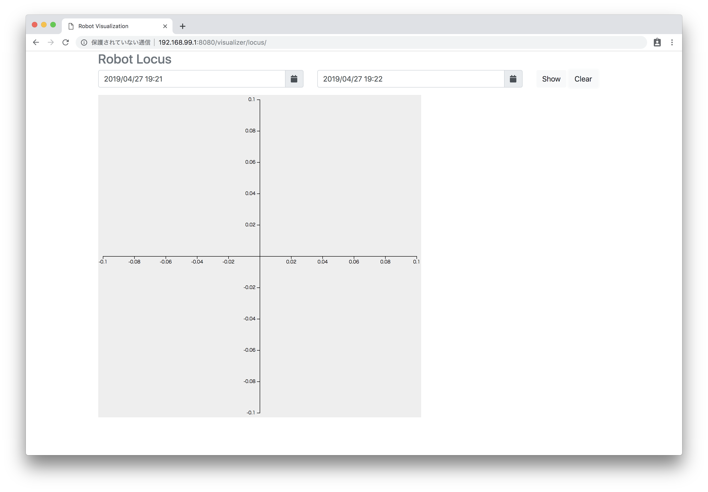

# Turtlebot3 試験環境 インストールマニュアル #7


## 構築環境(2019年3月19日現在)


# データの視覚化


## 環境設定

1. 環境変数の設定

   ```
   $ export CORE_ROOT=$HOME/core
   $ cd $CORE_ROOT;pwd
   ```

    - 実行結果（例）

        ```
        /home/fiware/core
        ```

   ```
   $ export PJ_ROOT=$HOME/example-turtlebot3
   $ cd $PJ_ROOT;pwd
   ```

    - 実行結果（例）

        ```
        /home/fiware/example-turtlebot3
        ```

1. 環境ファイルの実行

    ```
    $ source $CORE_ROOT/docs/minikube/env
    $ source $PJ_ROOT/docs/minikube/env
    ```

1. minikubeのexternal Interface名を確認

    ```
    $ export LANG=C
    $ ifconfig 
    ```

    - 実行結果（例）

        ```
        docker0   Link encap:Ethernet  HWaddr 02:42:c5:c0:3e:8f  
                inet addr:172.17.0.1  Bcast:172.17.255.255  Mask:255.255.0.0
                inet6 addr: fe80::42:c5ff:fec0:3e8f/64 Scope:Link
                UP BROADCAST MULTICAST  MTU:1500  Metric:1
                RX packets:0 errors:0 dropped:0 overruns:0 frame:0
                TX packets:719 errors:0 dropped:0 overruns:0 carrier:0
                collisions:0 txqueuelen:0 
                RX bytes:0 (0.0 B)  TX bytes:94805 (94.8 KB)

        enp0s25   Link encap:Ethernet  HWaddr 70:58:12:df:c6:b3  
                inet addr:172.16.10.25  Bcast:172.16.255.255  Mask:255.255.0.0
                inet6 addr: fe80::2f10:a3f2:1147:afdc/64 Scope:Link
                UP BROADCAST RUNNING MULTICAST  MTU:1500  Metric:1
                RX packets:17277974 errors:0 dropped:4 overruns:0 frame:0
                TX packets:9452435 errors:0 dropped:0 overruns:0 carrier:0
                collisions:0 txqueuelen:1000 
                RX bytes:7937676158 (7.9 GB)  TX bytes:767611835 (767.6 MB)
                Interrupt:20 Memory:f7c00000-f7c20000 

        lo        Link encap:Local Loopback  
                inet addr:127.0.0.1  Mask:255.0.0.0
                inet6 addr: ::1/128 Scope:Host
                UP LOOPBACK RUNNING  MTU:65536  Metric:1
                RX packets:14175937 errors:0 dropped:0 overruns:0 frame:0
                TX packets:14175937 errors:0 dropped:0 overruns:0 carrier:0
                collisions:0 txqueuelen:1 
                RX bytes:1585161123 (1.5 GB)  TX bytes:1585161123 (1.5 GB)

        vboxnet0  Link encap:Ethernet  HWaddr 0a:00:27:00:00:00  
                inet addr:192.168.99.1  Bcast:192.168.99.255  Mask:255.255.255.0
                inet6 addr: fe80::800:27ff:fe00:0/64 Scope:Link
                UP BROADCAST RUNNING MULTICAST  MTU:1500  Metric:1
                RX packets:0 errors:0 dropped:0 overruns:0 frame:0
                TX packets:5233 errors:0 dropped:0 overruns:0 carrier:0
                collisions:0 txqueuelen:1000 
                RX bytes:0 (0.0 B)  TX bytes:1690139 (1.6 MB)

        wlp3s0    Link encap:Ethernet  HWaddr               10:0b:a9:64:99:64  
                UP BROADCAST MULTICAST  MTU:1500  Metric:1
                RX packets:0 errors:0 dropped:0 overruns:0 frame:0
                TX packets:0 errors:0 dropped:0 overruns:0 carrier:0
                collisions:0 txqueuelen:1000 
                RX bytes:0 (0.0 B)  TX bytes:0 (0.0 B)
        ```

        ※このパソコンの場合はenp0s25

1. minikubeのexternal ipを設定

    ```
    $ export IFNAME=enp0s25
    $ export EXTERNAL_HOST_IPADDR=$(ifconfig $IFNAME | awk '/inet / {print $2}' | cut -d: -f2);echo ${EXTERNAL_HOST_IPADDR}
    ```

    - 実行結果（例）

        ```
        172.16.10.25
        ```


## turtlebot3の軌跡を表示

1. turtlebot3の軌跡を表示

    ```
    $ xdg-open http://${HOST_IPADDR}:8080/visualizer/locus/
    ```

1. ユーザ名とパスワードの確認

    ```
    $ cat ${CORE_ROOT}/secrets/auth-tokens.json | jq '.[0].settings.basic_auths | map(select(.allowed_paths[] | contains ("/visualizer/locus/"))) | .[0].username' -r
    ```

    ```
    $ cat ${CORE_ROOT}/secrets/auth-tokens.json | jq '.[0].settings.basic_auths | map(select(.allowed_paths[] | contains ("/visualizer/locus/"))) | .[0].password' -r
    ```

1. turtlebot3側で下記を実施

    1. ユーザ名とパスワードを入力しログイン

        

    1. turtlebot3を動かした日付と時間を「start datetime」と「end datetime」に入力し「show」をクリック

        

    1. turtlebt3が移動移動した軌跡が表示されることを確認

        
